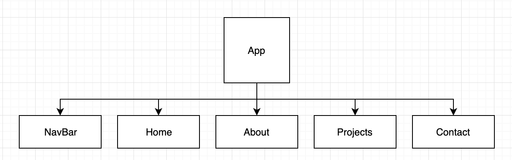

# Portfolio

## Project Description

This app provides a space to present my personal portfolio for prospective employers or anyone who is interested in learning more about me and my work.

## Front-End Technologies

- React
- React-router
- CSS
- React-icons

## Wireframes

## User Stories

_**MVP User Stories**_

- _As a user, I want to read about this particular engineer._
- _As a user, I want to view this developer's projects and repositories._
- _As a user, I want to easily contact this individual and download their resume._

_**Post MVP Stretch Goals**_

- _As a user, I want to submit a contact form to reach out to this person through the website._
- _As a user, I want to sign up and create an account to comment on posts._

## Component Hierarchy

